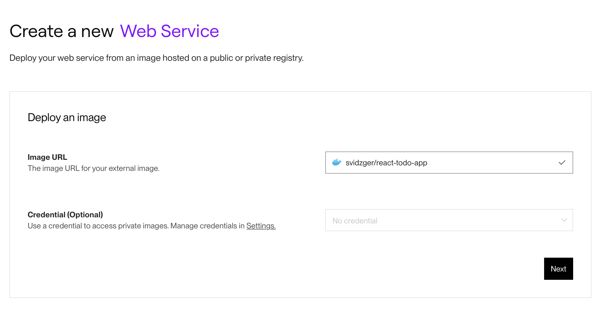
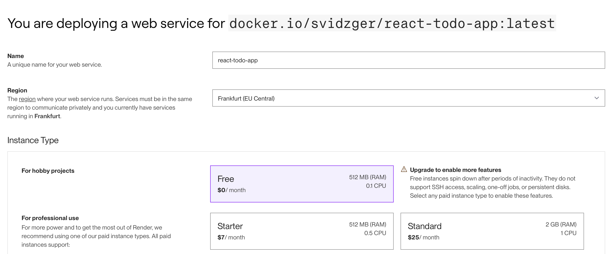
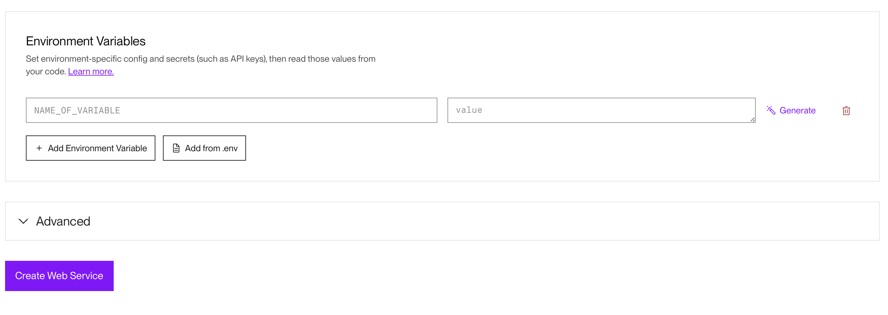
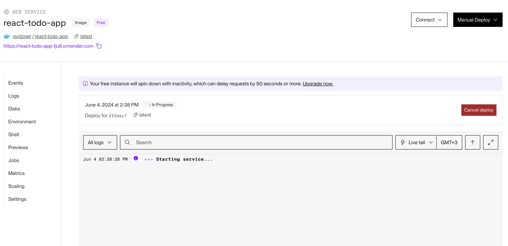
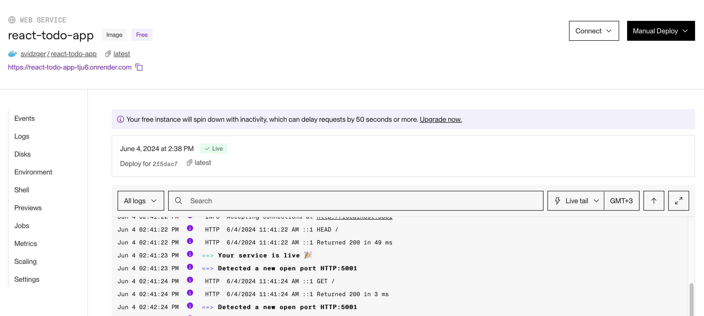

## Exercises 1.15-1.16

### 1.15

Link to my Docker Hub [react-todo-app image](https://hub.docker.com/r/svidzger/react-todo-app).

Run conainer with command:
`docker run --rm -p 5001:5001 svidzger/react-todo-app`

### 1.16

Link to running [react-todo-app](https://react-todo-app-tju6.onrender.com) on render.

You can find Dockerfile for this exercise [here](exercise-1.16/Dockerfile).

Here are some screenshots of deployment process.

